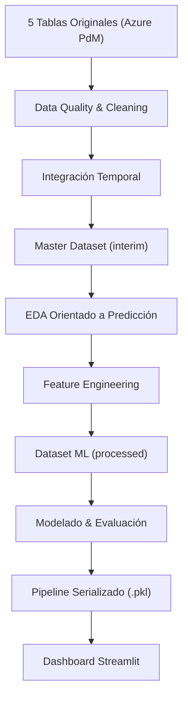

# Roadmap Técnico Oficial — PredictiveMaintenance

## Estado actual

- **Dataset seleccionado:** Azure Predictive Maintenance (Azure PdM)
- Discovery completado
- `01_data_exploration.ipynb` completado
- `02_data_cleaning.ipynb` completado
- `03_eda.ipynb` completado
- `04_feature_engineering.ipynb` en cierre
- `05_modeling.ipynb` en proceso
- `06_explainability.ipynb` en proceso
- `07_dashboard.ipynb` en proceso
- Estructura base del proyecto creada
- **Próxima fase:** Feature Engineering → Modelado → Integración al Dashboard

**Objetivo de esta fase:** El objetivo de esta fase es crear un modelo de machine learning que pueda predecir fallas en las máquinas.

## 1. Visión general del flujo de datos

Azure PdM está compuesto por cinco fuentes principales:
- `PdM_telemetry.csv`
- `PdM_errors.csv`
- `PdM_failures.csv`
- `PdM_maint.csv`
- `PdM_machines.csv`

El dataset de Azure PdM está compuesto por telemetría horaria de 100 máquinas con variables de voltaje, rotación, presión y vibración, además de registros separados de errores, mantenimiento, fallas y características de las máquinas.

### Evolución del dato



## 2. Estructura recomendada de datos

```text
data/
├── raw/
│   ├── PdM_telemetry.csv
│   ├── PdM_errors.csv
│   ├── PdM_failures.csv
│   ├── PdM_maint.csv
│   └── PdM_machines.csv
├── interim/
│   └── master_dataset.parquet
└── processed/
    └── features_dataset.parquet
```

### Regla de las capas

- **`raw/`**: Datos originales. No modificar. Mantener la fuente intacta. Documentar procedencia y versión.
- **`interim/`**: Datos integrados antes del Feature Engineering final. Aquí se ubicará el `master_dataset.parquet`.
- **`processed/`**: Datos preparados para Machine Learning. Aquí se ubicará posteriormente `features_dataset.parquet`.

## 3. Estructura de código

```text
src/
├── data/
│   ├── load_data.py
│   └── make_dataset.py
├── features/
│   └── build_features.py
├── models/
│   ├── train.py
│   ├── evaluate.py
│   └── predict.py
└── utils/
    └── helpers.py
```

No es necesario desarrollar todos estos módulos inmediatamente. Primero se validará el proceso mediante notebooks. Cuando el flujo esté estable, las transformaciones reproducibles podrán migrarse progresivamente a `src/`.

## 4. FASE 1 — Data Cleaning y Data Quality

### Notebook: `02_data_cleaning.ipynb`

**Objetivo:** Responder: *¿Podemos confiar en los datos y utilizarlos para construir una base temporal consistente?* Este notebook debe concentrarse en: estructura, tipos, fechas, identificadores, nulos, duplicados, valores inválidos, rangos, consistencia temporal y consistencia entre tablas.

> [!NOTE]
> **Importante:** No convertir este notebook en el EDA completo ni en un notebook de modelado. Puede incluir tablas de validación y gráficos puntuales de calidad cuando sean útiles para comprobar un problema de datos, pero el análisis de patrones de fallas y señales se reservará principalmente para `03_eda.ipynb`.

## 5. Validación de las cinco fuentes

### 5.1 Telemetría

Revisar como mínimo: `df_telemetry.info()`, `df_telemetry.describe()`, `df_telemetry.isnull().sum()`, `df_telemetry.duplicated().sum()`. Validar especialmente: `machineID`, `datetime`, `volt`, `rotate`, `pressure`, `vibration`. La fuente de telemetría contiene mediciones horarias de voltaje, rotación, presión y vibración para las máquinas del conjunto.

### 5.2 Errors

Validar: `machineID`, `datetime`, `errorID`. Comprobar: tipos, duplicados, máquinas válidas, fechas válidas, distribución de códigos de error. Los errores no deben confundirse automáticamente con fallas: en el dataset, los errores son eventos de operación y no equivalen necesariamente a una falla que provoque parada.

### 5.3 Failures

Validar: `machineID`, `datetime`, `failure`. Comprobar: número de eventos, distribución por tipo/componente, máquinas afectadas, fechas, posibles duplicados. Los registros de `PdM_failures` representan reemplazos de componentes debido a una falla y constituyen un subconjunto de los registros de mantenimiento.

### 5.4 Maintenance

Validar: `machineID`, `datetime`, `comp`. Además, documentar cualquier otra columna disponible. Comprobar: fechas, componentes, tipos de intervención si existen, duplicados, relación temporal con las máquinas. La tabla de mantenimiento incluye intervenciones programadas y reactivas; las fallas también aparecen en la información de mantenimiento, por lo que no debe duplicarse esa información ingenuamente al integrar ambas tablas.

### 5.5 Machines

Validar: `machineID`, `model`, `age`. Comprobar: unicidad de `machineID`, modelos, rangos de edad, máquinas presentes en telemetría. La fuente de máquinas aporta el tipo/modelo y edad del equipo.

## 6. Conversión y validación temporal

Convertir todas las columnas datetime (ej. `pd.to_datetime(...)`) y después ordenar: `df = df.sort_values(["machineID", "datetime"])`. Validar: fechas mínimas y máximas, registros duplicados por `machineID` + `datetime`, continuidad temporal de la telemetría, posibles huecos.

> [!IMPORTANT]
> **Regla importante:** La información temporal será fundamental para el modelado posterior. Por tanto, no basta con que las fechas sean parseables: deben quedar correctamente ordenadas y alineadas entre las diferentes fuentes.

## 7. Construcción del Master Dataset

Esta es una de las partes críticas del proyecto.

### Tabla base

La tabla base será: `PdM_telemetry` porque proporciona el timeline principal de observaciones de cada máquina. Conceptualmente: 1 fila = máquina + instante de telemetría. La telemetría está registrada a frecuencia horaria.

## 8. ⚠️ Regla crítica de integración temporal

> [!WARNING]
> **NO hacer joins directos por `machineID` entre telemetría y las tablas de eventos.**
> Ejemplo incorrecto: `telemetry.merge(failures, on="machineID")`. Esto puede multiplicar filas porque una máquina puede tener muchos eventos de fallas, errores y mantenimientos.

La integración debe considerar: `machineID` + `datetime` + relación temporal. Dependiendo del objetivo, utilizar: `merge_asof`, ventanas temporales, conteos históricos, flags de eventos, diferencias temporales, agregaciones por período. Esto es especialmente importante para evitar duplicación y, posteriormente, data leakage.

## 9. Integración de machines

Esta es la integración más directa: `telemetry` + `machines` por `machineID`. Obtener, cuando corresponda: `model`, `age`. Estas variables representan características relativamente estáticas de cada equipo.

## 10. Integración de errors

Los errores son eventos temporales. No convertir cada error en un join que multiplique filas. En su lugar, para el dataset analítico pueden construirse variables temporales como: `has_error_recent`, `errors_last_24h`, `errors_last_7d`, `distinct_errors_last_24h`, `time_since_last_error`. Siempre utilizando **solo información disponible hasta el instante de predicción**.

## 11. Integración de maintenance

La información de mantenimiento también es temporal. En lugar de crear una columna de mantenimiento mediante un join directo, construir posteriormente features como: `has_recent_maintenance`, `hours_since_maintenance`, `days_since_maintenance`, `maintenance_count_30d`, `time_since_last_component_replacement`. Todas deben calcularse respetando el tiempo de predicción.

## 12. Integración de failures

Las fallas son fundamentales para construir el target. No utilizar simplemente: `failure = 1` como target de la misma fila de telemetría si el objetivo es anticipar la falla. La pregunta que debemos responder es: **¿Ocurrirá una falla en el futuro cercano dado lo observado hasta este momento?**

## 13. Target propuesto — `failure_next_24h`

Hipótesis inicial: `failure_next_24h = 1` si para una máquina ocurre una falla dentro de las siguientes 24 horas después del instante de observación. Formalmente: $(t, t + 24h]$ para la misma `machineID`. Ejemplo conceptual: `09:00` → no falla en las próximas 24h → `0`, `10:00` → no falla en las próximas 24h → `0`, `11:00` → falla registrada mañana → `1`.

### Validación requerida

Antes de congelar `failure_next_24h`, calcular: cantidad de positivos, porcentaje positivo, distribución por máquina, cantidad de eventos suficientemente separados, sensibilidad a otros horizontes. Evaluar, si fuese necesario: `failure_next_24h`, `failure_next_48h`, `failure_next_72h`, `failure_next_7d`. La elección definitiva debe basarse en:
1. Utilidad de negocio
2. Disponibilidad estadística de positivos
3. Capacidad predictiva
4. Viabilidad para el MVP

## 14. ⚠️ Regla principal contra Data Leakage

> [!CAUTION]
> Para una observación en el tiempo $t$: **Todas las features deben construirse exclusivamente con información disponible hasta $t$.**

No utilizar: mantenimientos futuros, fallas futuras, errores futuros, sensores posteriores a $t$, información generada después del evento objetivo. La falla futura puede utilizarse para construir el target, pero nunca como feature.

## 15. Entregable de Data Cleaning

El notebook debe producir: `data/interim/master_dataset.parquet`

Pero solamente después de validar: claves, fechas, duplicados, integridad, cardinalidad, relaciones entre tablas, alineación temporal. El `master_dataset` debe ser una base analítica integrada, todavía sin todas las features avanzadas de Machine Learning.

## 16. FASE 2 — EDA orientado a predicción

### Notebook: `03_eda.ipynb`

**Objetivo:** Responder: *¿Qué señales o comportamientos aparecen antes de una falla?* No debe limitarse a un EDA descriptivo. El EDA debe ayudar a determinar: qué variables pueden ser predictivas, qué comportamientos cambian antes de una falla, qué relaciones son plausibles, qué features deberían construirse, qué problemas existen antes del modelado.

## 17. Análisis mínimo del EDA

### Pregunta 1 — ¿Cuántas fallas existen?

`df["failure"].value_counts()` o según la estructura final del dataset: `df["failure_type"].value_counts()`

### Pregunta 2 — ¿Existe desbalance?

Evaluar: cantidad positiva, cantidad negativa, porcentaje. Usar visualización cuando sea útil.

## 18. Variables de telemetría

Analizar: `volt`, `rotate`, `pressure`, `vibration`. Por: distribución, rango, valores atípicos, comportamiento por máquina, comportamiento por modelo, diferencias entre períodos normales y previos a falla.

## 19. Tendencias temporales

Esta parte es prioritaria. Analizar especialmente: `vibration`, `pressure`, `rotate`, `volt` y observar ventanas antes de fallas. Ejemplo conceptual: Normal → cambio de comportamiento → deterioro → falla. La utilidad del análisis estará en comprobar si realmente existe evidencia de este patrón.

## 20. Correlaciones

Puede utilizarse: `sns.heatmap(...)` pero la correlación no debe considerarse evidencia suficiente de causalidad. Complementar con: comportamiento temporal, distribución, análisis por máquina, análisis antes/después de eventos.

## 21. FASE 3 — Feature Engineering

### Notebook: `04_feature_engineering.ipynb`

Aquí se construirá el dataset específico para ML.

### Grupo A — Features de máquina

Desde `PdM_machines`: `age`, `model`. Codificación de `model`: One-Hot Encoding o LabelEncoding (Solo cuando sea apropiado para el modelo. Si se usa LabelEncoder, recordar usar `fit_transform` en el train set y `transform` en los otros sets para evitar data leakage).

## 22. Grupo B — Telemetría

Variables originales: `volt`, `rotate`, `pressure`, `vibration`. Estas pueden conservarse y también utilizarse como base para features temporales.

## 23. Grupo C — Rolling Features

Por `machineID`. Ejemplos: `rolling_mean_3`, `rolling_mean_6`, `rolling_mean_24` para: `volt`, `rotate`, `pressure`, `vibration`.

> [!NOTE]
> **Importante:** Como la telemetría es horaria, estas ventanas pueden representar aproximadamente 3, 6 y 24 horas si no existen huecos. Cuando sea posible, preferir ventanas temporales basadas en tiempo y comprobar discontinuidades antes de asumir que N filas = N horas. También considerar: `rolling_std`, `rolling_min`, `rolling_max` cuando tengan sentido.

## 24. Grupo D — Tendencias / cambios

Ejemplos: `volt_delta`, `rotate_delta`, `pressure_delta`, `vibration_delta`. También evaluar: `rate_of_change`, `rolling_slope` cuando aporten información útil.

## 25. Grupo E — Error History

Desde `PdM_errors`: `errors_last_24h`, `errors_last_7d`, `distinct_errors_last_24h`, `time_since_last_error`. Todas estas variables deben respetar el tiempo de corte de la observación.

## 26. Grupo F — Maintenance Features

Desde `PdM_maint`: `hours_since_maintenance`, `days_since_maintenance`, `maintenance_count_30d`, `time_since_last_component_replacement`. No utilizar información de mantenimiento posterior al instante $t$.

## 27. Grupo G — Failure Target

Target candidato: `failure_next_24h`.

Debe quedar documentado: cómo se calculó, qué ventana temporal utiliza, qué registros positivos produjo, qué proporción representa, qué riesgo de leakage se descartó. La ventana definitiva no debe asumirse de manera automática. Debe justificarse con datos.

## 28. FASE 4 — Modelado (Semana 3)

### Notebook: `05_modeling.ipynb`

**Estado:** Inicia al comienzo de la Semana 3. Esta actividad se desplaza desde la Semana 2 por el tiempo requerido para completar las fases previas. La prioridad será obtener una evaluación confiable y un modelo viable para el MVP, evitando ampliar el alcance sin necesidad.

**Objetivo:** Entrenar y comparar un baseline y un modelo principal, medir su desempeño con separación temporal y documentar las decisiones. Antes de entrenar, confirmar que el dataset de features, el target y la estrategia de partición estén definidos y validados.

## 29. Validación temporal

No utilizar por defecto: `train_test_split(..., shuffle=True)` porque el problema es temporal. Utilizar una separación cronológica: Train → Validation → Test. Por ejemplo: 70% Train, 15% Validation, 15% Test respetando el orden temporal. La estrategia definitiva debe documentarse.

## 30. Baseline

Modelo inicial: `LogisticRegression`. Objetivo: Establecer una referencia sencilla y explicable.

## 31. Modelo principal

Primera opción: `RandomForestClassifier`. Porque permite construir un baseline no lineal y ofrece herramientas sencillas para análisis de importancia de variables.

## 32. Modelos adicionales

Solo si existe tiempo y valor real: `XGBoost`, `LightGBM`. No son obligatorios para el MVP. La prioridad no será utilizar el algoritmo más sofisticado, sino lograr un modelo bien validado y útil para el criterio de éxito.

## 33. Métricas

Prioridad para un escenario de fallas: **Recall** porque no detectar una falla potencial puede ser costoso. Complementar con: Precision, F1, ROC-AUC, PR-AUC, Matriz de confusión. No utilizar Accuracy como única métrica. La elección final debe considerar el costo relativo de falsos negativos y falsos positivos.

## 34. FASE 5 — Explicabilidad

### Notebook opcional: `06_explainability.ipynb`

Herramientas posibles: Feature Importance, Permutation Importance, SHAP.

Pregunta principal: **¿Por qué esta máquina presenta alto riesgo?** La explicación debe conectar el modelo con variables comprensibles para mantenimiento. No afirmar causalidad física únicamente porque una variable tenga alta importancia en el modelo.

## 35. FASE 6 — Serialización

Responsabilidad principal: **ML Pipeline & Integration**

Artefactos previstos:
```text
models/
├── pdm_pipeline.pkl
├── features.pkl
└── metrics.json
```

Las rutas definitivas pueden ajustarse cuando la implementación esté estabilizada.

## 36. FASE 7 — Integración con Streamlit

El dashboard deberá consumir artefactos ya entrenados:
Dashboard → `pdm_pipeline.pkl` → `features` / `input` → predicción → riesgo → explicación → prioridad.

> [!IMPORTANT]
> **Regla:** El dashboard NO debe entrenar, NO debe recalcular todo el pipeline de entrenamiento y NO debe depender de notebooks para funcionar. Debe utilizar funciones y artefactos reproducibles provenientes de `src/` y `models/`.

## 37. Evolución hacia código reproducible

Los notebooks se utilizarán inicialmente para explorar y validar. Cuando una transformación quede estable: Notebook → Validación → Código reproducible en `src/`. Esto evita que la lógica definitiva del proyecto termine únicamente dentro de notebooks.

## 38. Entregable técnico esperado

La arquitectura final deberá evolucionar hacia:

```text
src/
├── data/
├── features/
├── models/
└── utils/

models/
├── pdm_pipeline.pkl
├── features.pkl
└── metrics.json

data/
├── raw/
├── interim/
└── processed/
```

## 39. Principios técnicos prioritarios

1. **Target correcto:** La definición de `failure_next_24h` debe validarse antes de modelar.
2. **No data leakage:** Ninguna feature puede utilizar información posterior al instante de predicción.
3. **Integración temporal correcta:** No realizar joins ingenuos de tablas de eventos por `machineID`.
4. **Reproducibilidad:** Toda transformación importante debe poder trasladarse posteriormente desde notebook a `src/`.
5. **Interpretabilidad:** Las variables y predicciones deben poder explicarse dentro del contexto de mantenimiento.
6. **Simplicidad:** No añadir complejidad tecnológica si no mejora el MVP.

## 40. Orden inmediato de trabajo

### Ahora (Inmediato)

1. Terminar `04_feature_engineering.ipynb`.
2. Validar la estructura e integridad de `master_dataset.parquet`.
3. Construir el `features_dataset.parquet` con integración temporal correcta.
4. Documentar decisiones de diseño y hallazgos de calidad de datos.

### Después (Siguiente Fase)

5. Validar si existen señales previas a las fallas (early indicators).
6. Definir y documentar el target (`failure_next_24h`).
7. Construir y ejecutar `05_modeling.ipynb`.
8. Preparar modelo baseline (`LogisticRegression`) y modelo principal (`RandomForestClassifier`).
9. Comenzar la integración al dashboard inicial en Streamlit.

## 41. Criterio de salida de Feature Engineering / entrada a Modelado

Antes de entrenar, comprobar:

- Las cinco tablas están validadas.
- Las fechas son consistentes.
- `machineID` está validado.
- No existen duplicados críticos.
- La integración temporal está documentada.
- No hay multiplicación indebida de filas.
- Las variables históricas respetan el tiempo.
- El target candidato es viable.
- Se conoce la distribución de la clase positiva.
- Se tiene un dataset de features reproducible y validado.

## 42. Prioridad del proyecto

El algoritmo no es el principal riesgo técnico. Las prioridades son:

1. Target
2. Integración temporal
3. Prevención de Data Leakage
4. Feature Engineering
5. Validación temporal
6. Modelo
7. Explicabilidad
8. Dashboard

El objetivo final continúa siendo el criterio de éxito:

**Identificar riesgo → Comprender por qué → Priorizar intervención.**

## 43. Cronograma resumido actualizado

| Semana | Estado / Foco | Resultado Esperado |
| :--- | :--- | :--- |
| **Semana 1** | Discovery, selección de Azure PdM y estructura inicial | Dataset seleccionado y repositorio organizado |
| **Semana 2** | Data Cleaning, integración, EDA y Feature Engineering | Master Dataset validado y dataset de features en cierre |
| **Semana 3** *(Actual)* | Modelado, validación temporal y selección del modelo candidato | Baseline, modelo principal, métricas y decisión documentada |
| **Semana 4** | Serialización, reproducibilidad, explicabilidad e integración al Dashboard | Pipeline consumible por Streamlit y MVP integrado |

> [!NOTE]
> **Nota de planificación:** El inicio de Modelado se mueve de la Semana 2 a la Semana 3. Se conserva el enfoque MVP: priorizar validación, calidad del target y prevención de leakage antes que la cantidad o complejidad de algoritmos.
